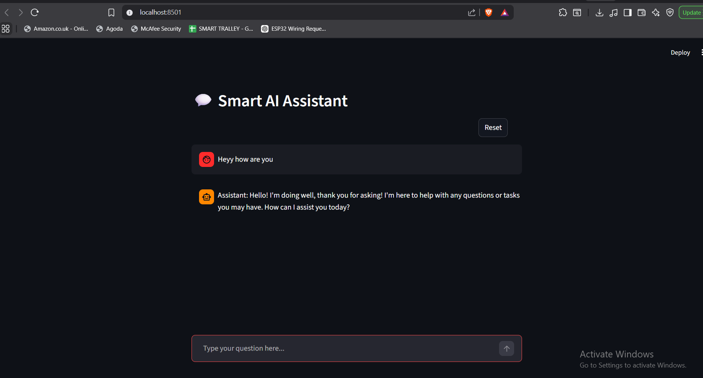

# 🤖 Smart AI Assistant

An AI chatbot built using Streamlit and LangChain, powered by a local LLM using Ollama.

---

## 🚀 Features

* 💬 Chat interface using Streamlit
* 🧠 LangChain pipeline
* ⚡ Local LLM (Ollama - LLaMA2)
* 🔄 Chat history
* 🔁 Reset functionality

---

## 🛠️ Tech Stack

* Python
* Streamlit
* LangChain
* Ollama

---

---

## ⚙️ How to Run

```bash
git clone https://github.com/Rupesh5151/ai-chatbot-ollama.git
cd ai-chatbot-ollama
pip install -r requirements.txt
ollama run llama2
streamlit run app.py
```

---

## ⚠️ Note

Make sure Ollama is running locally before starting the app.

---

## 👨‍💻 Author

Rupesh kumar sah
